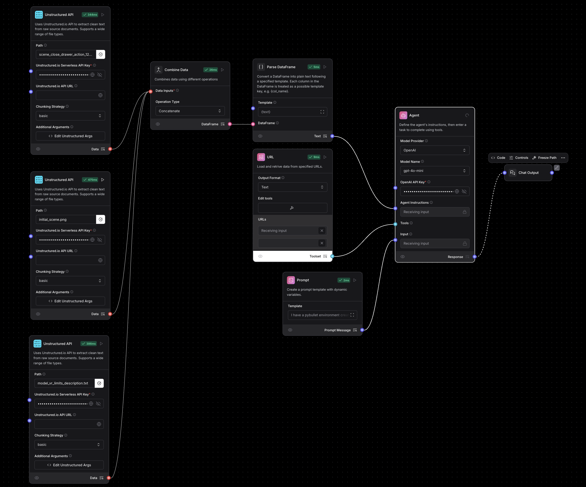
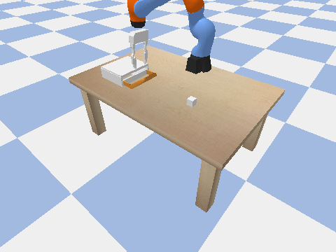

# robocopilot
WINNER - Best use of OpenAI, Hack Agents hackathon 2025
An AI coding assistant tool specifically for robot programming

VIDEO - https://drive.google.com/file/d/1kXq-WmxKcNMi7GpWVtIblE6G9McjjVyy/view?usp=drive_link

<!-- Embed video using HTML -->
<video width="600" controls>
  <source src="langflow/hack-agents-final.mp4" type="video/mp4">
  Your browser does not support the video tag.
</video>

RoboCopilot is an agentic workflow using OpenAI models. It has the following structure on LangFlow:

Current LLMs struggle with generate robot programming for simple tasks like

1. Robot opens a drawer
2. Robot picks part and puts it in the drawer
3. Robot closes the drawer.

From our tests, we noticed that the robot just flails around, and goes nowhere close to the target objects when we asked Claude, GPT to generate code for the above tasks. This is because LLMs lack knowledge of the physical world and any notion of physical space.

We try to impart this knowledge to the LLM by exporting the following data from the physics simulator (PyBullet):

1. We convert the SDF file of the environment having information about 3d positions of all objects into a simple text file

2. We include individual URDFs of the robot and other 3D objects

3. We add an image of the initial scene

With this information, the LLM actually produces slightly improved code, with the robot at least moving to the expected locations of the objects.

Future work:

1) This can be further improved by imparting knowledge of physical properties like gravity and friction.

2) We could finetune the model to recognize PyBullet Environments in a suitable embedding that's understood by the LLM.
